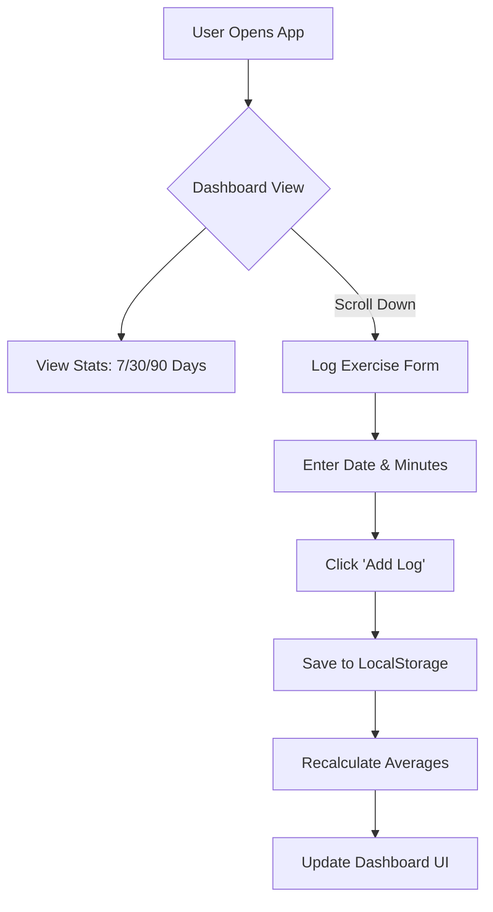
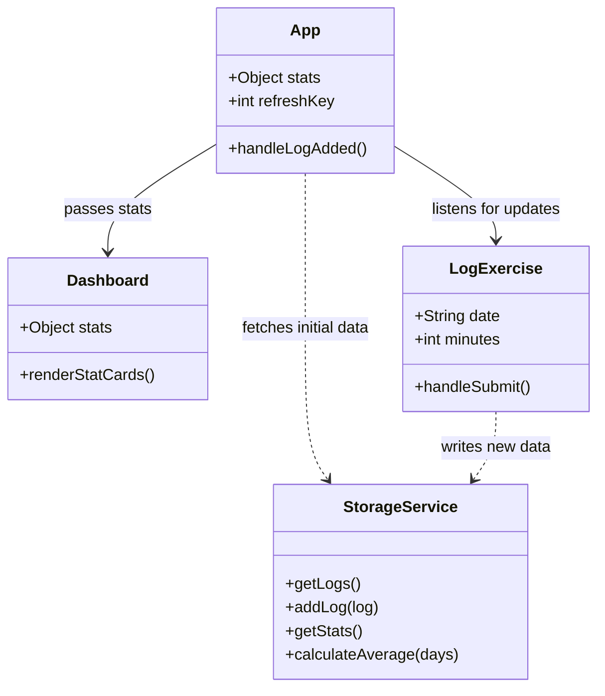

# LegWalker Agent Context

This file is designed to provide context for AI agents (LLMs) to understand the architecture, logic, and build process of LegWalker for future development.

## Project Overview
LegWalker is a mobile-first exercise tracking application built as a Progressive Web App (PWA) and wrapped for Android using Capacitor. It focuses on simplicity, premium aesthetics (dark mode), and offline functionality.

## Technology Stack
- **Frontend**: React 18, Vite
- **Styling**: Vanilla CSS (CSS Variables, Dark Mode, Mobile-First)
- **State Management**: React `useState` + LocalStorage
- **Mobile Wrapper**: Capacitor (Android Platform)
- **Build Tool**: Gradle (using local portable JDK/SDK tools)

## Architecture

### Data Model
Data is persisted in `localStorage` under the key `legwalker_logs` as a JSON string.
**Schema**:
```json
[
  {
    "id": "1704445555555",        // Unique Log ID
    "date": "2024-01-05",         // YYYY-MM-DD (Input Date)
    "minutes": 45,                // Integer duration
    "timestamp": "2024-01-05..."  // ISO String (Created At)
  }
]
```

### Directory Structure
```
src/
├── components/
│   ├── Dashboard.jsx       # Stats display (Cards + Progress Bar)
│   └── LogExercise.jsx     # Input form logic
├── utils/
│   └── storage.js          # CRUD logic for LocalStorage & Math helpers
├── App.jsx                 # Main layout & State Container
└── index.css               # Design System (Variables, Reset, Base Styles)
tools/                      # Portable JDK & Android SDK (See Build Process)
```

## Diagrams

### User Interaction Flow


### Component Architecture


## Build & Deployment

### Web (PWA)
1. `npm install`
2. `npm run dev` (Localhost)
3. `npm run build` (Dist folder)

### Android (Native APK)
**Critical**: This project uses a **Local Portable Environment** because system environment variables are not set.
Do NOT use standard `gradle` commands.

**To Build APK**:
Run the PowerShell script:
```powershell
./build_with_jdk21.ps1
```
This script sets `JAVA_HOME` and `ANDROID_HOME` to the `tools/` directory before triggering Gradle.

**Output Location**:
`android/app/build/outputs/apk/debug/app-debug.apk`

## Roadmap & Future Tasks
1. **Visualization**: Replace simple stats with charts (recharts/chart.js).
2. **Data Portability**: Add Export/Import JSON feature.
3. **Gamification**: "Streaks" or "Badges" based on consistency.
