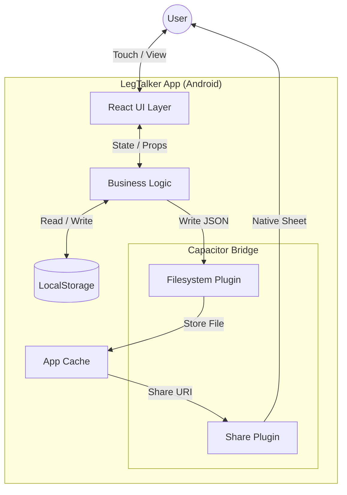
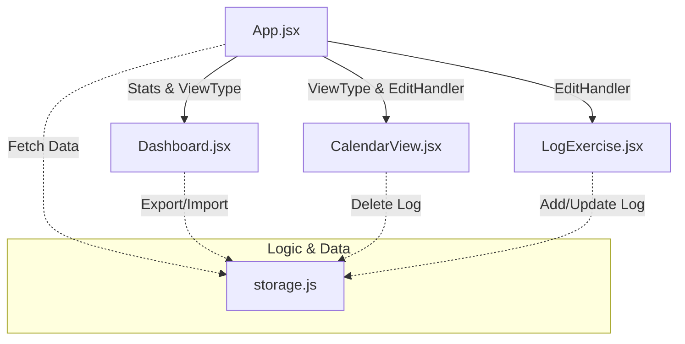
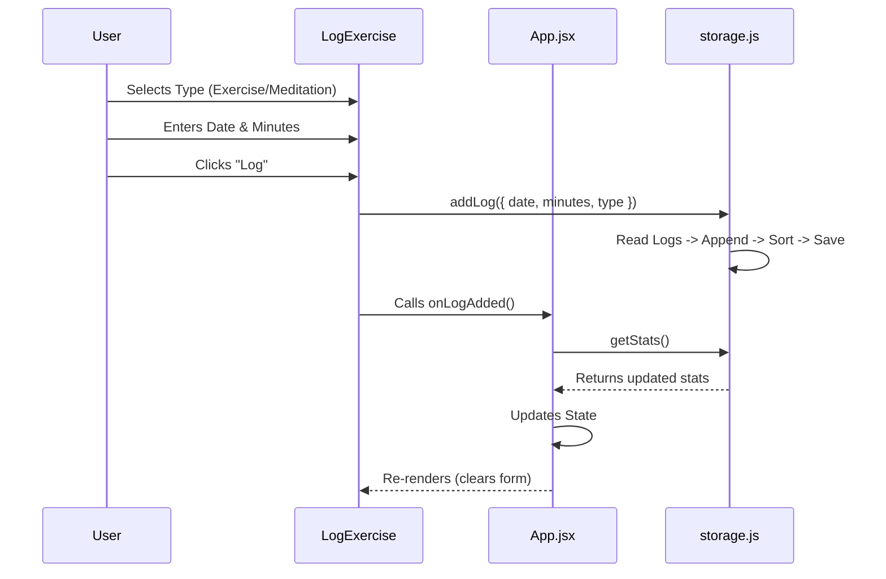
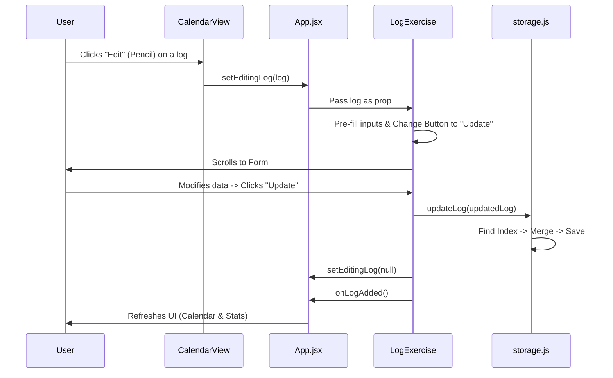
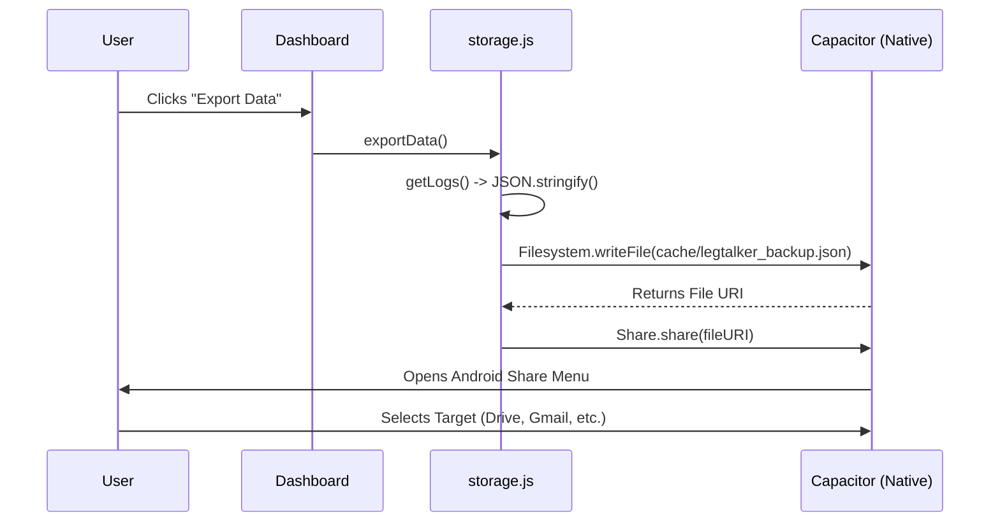

# LegTalker Architecture Documentation

This document outlines the technical architecture of the **LegTalker** application (v3.2).

## 1. System Overview
LegTalker is a **Hybrid Mobile Application** built with React and wrapped natively using Capacitor. It operates entirely offline, using the device's local storage and file system.

## 2. Component Hierarchy
The UI is structured as a single-page application (SPA) with three main interactive zones.

## 3. Data Schema
Data is stored as a JSON string in `localStorage` key `legwalker_logs`.

| Field | Type | Description |
| :--- | :--- | :--- |
| `id` | `string` | Unique timestamp-based ID (e.g. "1704445555555") |
| `date` | `string` | Log date (YYYY-MM-DD) based on Local Time |
| `minutes` | `number` | Duration of activity |
| `type` | `string` | 'exercise' (default) or 'meditation' |
| `timestamp` | `string` | Creation timestamp (ISO string) |

## 4. Key Workflows

### A. Logging an Activity
How data flows when a user adds a new entry.

### B. Editing an Existing Log
The interaction between Calendar (Selection) and Form (Editing).

### C. Native Export Process
How the app exports data using Android native features.

